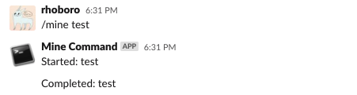

# Slack Slash Command Sample for Python

* refs: https://api.slack.com/interactivity/slash-commands

* Cloud Tasks
  * `gcloud tasks queues create <QUEUE_NAME>`
  * Check your GAE location

* GCF: mine
  * Environment variables
    * SLACK_TOKEN: `<SLACK_TOKEN>`
    * PROJECT: `<GCP_PROJECT>`
    * LOCATION: `<GAE_LOCATION>`
    * QUEUE_NAME: `<QUEUE_NAME>`
    * QUEUE_URL: `https://<GCF_LOCATION>-<PROJECT>.cloudfunctions.net/mine_response`

* GCF: mine_response
  * Environment variables
    * SLACK_TOKEN: `<SLACK_TOKEN>`

